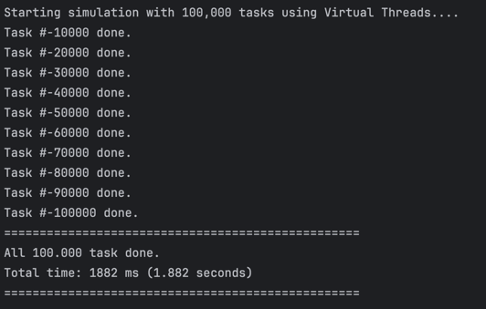

# Java Thread Demonstrations

This project demonstrates the differences between Platform Threads and Virtual Threads in Java 21, highlighting the advantages of the new Virtual Threads feature.

## Overview

Java 21 introduced Virtual Threads as a lightweight alternative to traditional Platform Threads. This project contains several demonstrations that showcase:

1. The limitations of Platform Threads when handling high concurrency
2. The memory footprint of Platform Threads
3. The superior scalability of Virtual Threads

## Prerequisites

- Java Development Kit (JDK) 21 or higher
- Maven 3.6 or higher

## Installation

1. Clone this repository:
   ```
   git clone https://github.com/yourusername/java-thread.git
   cd java-thread
   ```

2. Build the project:
   ```
   mvn clean package
   ```

## Demonstrations

### 1. Platform Thread Failure Demo

`PlatformThreadFailureDemo.java` demonstrates how traditional platform threads fail when attempting to create a large number of threads (100,000). This is due to the significant memory overhead of platform threads.

To run:
```
java -cp target/classes com.khairul.stream.PlatformThreadFailureDemo
```

Expected outcome: The program will fail with an error, demonstrating the limitations of platform threads.

### 2. Platform Thread Memory Footprint

`PlatformThreadMemoryFootprint.java` shows the memory consumption of platform threads. It creates up to 20,000 platform threads and reports memory usage at regular intervals.

To run:
```
java -cp target/classes com.khairul.stream.PlatformThreadMemoryFootprint
```

Expected outcome: You'll see the memory usage increase significantly as more threads are created, potentially leading to an OutOfMemoryError.

### 3. Virtual Thread Success Demo

`VirtualThreadSuccessDemo.java` demonstrates how virtual threads can handle a much larger number of concurrent tasks (100,000) efficiently.

To run:
```
java -cp target/classes com.khairul.stream.VirtualThreadSuccessDemo
```

Expected outcome: The program successfully completes all 100,000 tasks, showing the scalability of virtual threads.


*Figure: Performance visualization of Virtual Threads handling 100,000 concurrent tasks*

## Key Differences Between Platform and Virtual Threads

| Feature | Platform Threads | Virtual Threads |
|---------|-----------------|----------------|
| Memory Usage | High (1-2 MB per thread) | Low (few KB per thread) |
| Max Concurrent Threads | Thousands | Millions |
| Stack Size | Fixed | Dynamic |
| Creation Cost | Expensive | Cheap |
| Scheduling | OS Scheduler | JVM Scheduler |

## Why Virtual Threads Matter

Virtual threads enable a simpler programming model for high-throughput concurrent applications. They allow developers to use the familiar thread-per-request style without the performance limitations of platform threads.
