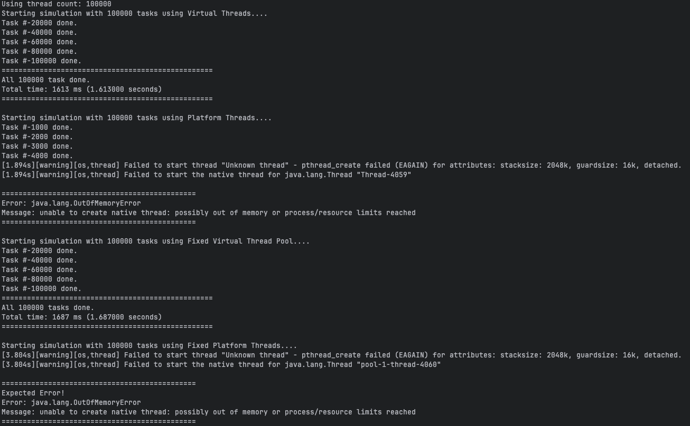

# Java Thread Demonstrations

This project demonstrates the differences between Platform Threads and Virtual Threads in Java 21, highlighting the advantages of the new Virtual Threads feature.

## Overview

Java 21 introduced Virtual Threads as a lightweight alternative to traditional Platform Threads. This project contains several demonstrations that showcase:

1. The limitations of Platform Threads when handling high concurrency (PlatformThreadFailureDemo)
2. The failure of fixed Platform Thread pools with large thread counts (FixedPlatformThreadFailureDemo)
3. The superior scalability of Virtual Threads with unlimited thread creation (VirtualThreadSuccessDemo)
4. The effectiveness of fixed Virtual Thread pools for controlled concurrency (FixedVirtualThreadPoolDemo)

## Prerequisites

- Java Development Kit (JDK) 21 or higher
- Maven 3.6 or higher

## Installation

1. Clone this repository:
   ```
   git clone https://github.com/khairultp/java-thread.git
   cd java-thread
   ```

2. Build the project:
   ```
   mvn clean package
   ```

## Running the Demonstrations

This project includes a Maven Wrapper, which allows you to run Maven commands without having Maven installed on your system.

To run all demonstrations at once using the Main class:

```
./mvn-run
```

This command will execute the Main class, which calls all three demonstration classes in sequence.



*Figure: Comparison of Platform Threads vs Virtual Threads performance*

## Key Differences Between Platform and Virtual Threads

| Feature | Platform Threads | Virtual Threads |
|---------|-----------------|----------------|
| Memory Usage | High (1-2 MB per thread) | Low (few KB per thread) |
| Max Concurrent Threads | Thousands | Millions |
| Stack Size | Fixed | Dynamic |
| Creation Cost | Expensive | Cheap |
| Scheduling | OS Scheduler | JVM Scheduler |

## Why Virtual Threads Matter

Virtual threads enable a simpler programming model for high-throughput concurrent applications. They allow developers to use the familiar thread-per-request style without the performance limitations of platform threads.
